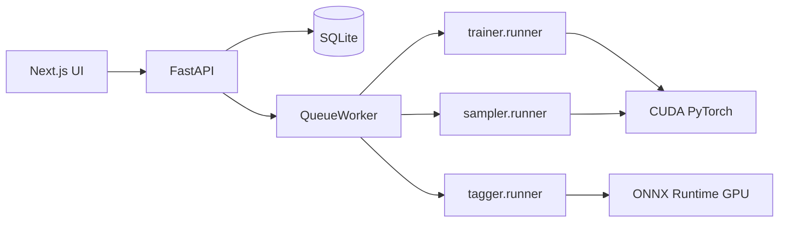

# LoRA Trainer

Local SDXL LoRA training app with job queue.

Train SDXL LoRAs on your own GPU with a web UI for dataset management, configuration, job monitoring, and Kohya-compatible export.

## Features

- **SDXL LoRA training** — UNet and optional text encoders via diffusers + peft
- **Kohya-compatible export** — `.safetensors` output for use in ComfyUI, A1111, and other tools
- **Web UI** — manage datasets, configs, jobs, and live training progress
- **Dataset pipeline** — crop, bucketing, preprocess, and caption editing
- **WD14 auto-tagging** — ONNX GPU tagger writes `.txt` captions
- **Sampling** — mid-training previews and standalone sampling jobs with LoRA weights
- **Job queue** — SQLite-backed queue with resume, cancel, and checkpointing
- **Config versioning** — training configs keep version history

## Architecture



The API starts an embedded queue worker on launch. The worker polls the database and spawns subprocesses for training, sampling, and tagging jobs.

## Requirements

- Python 3.12+
- [uv](https://docs.astral.sh/uv/) package manager
- Node.js (frontend)
- NVIDIA GPU with CUDA (PyTorch cu130)

## Quick Start

### Backend

```bash
uv sync
cp config.example.toml config.toml   # Windows: copy config.example.toml config.toml
```

Edit `config.toml` as needed (server host/port, database path, worker settings).

### Frontend

```bash
cd frontend
npm install
```

### Run (development)

**Windows** — starts API and frontend in separate terminals:

```bash
start-dev.cmd
```

**Manual / cross-platform:**

```bash
# API (with embedded worker)
uv run uvicorn src.api.main:app --reload --host 127.0.0.1 --port 8000

# Frontend
cd frontend && npm run dev
```

### URLs

| Service | URL |
|---|---|
| API | http://127.0.0.1:8000 |
| API docs | http://127.0.0.1:8000/docs |
| Frontend | http://localhost:3000 |

### Production (Windows)

```bash
start-prod.cmd
```

Builds the frontend and runs the API without hot reload.

## Typical Workflow

1. **Create a dataset** — point to a folder of images and `.txt` captions
2. **Configure resolution and bucketing** — set target resolution and optional bucket settings
3. **Preprocess** — crop images and bake to `.prepared/{resolution}/`
4. **(Optional) Auto-tag** — run a WD14 tagging job for empty captions
5. **Create a training config** — YAML with dataset concepts and hyperparameters
6. **Create and enqueue a job** — the worker picks it up automatically
7. **Monitor** — watch live logs, loss graph, and sample previews
8. **Resume or cancel** — resume from checkpoint; cancel with optional checkpoint save

## Configuration

### Application config (`config.toml`)

Copy from `config.example.toml`. Controls server, database, and worker settings:

```toml
[server]
host = "127.0.0.1"
port = 8000

[database]
path = "lora_trainer.db"

[training]
worker_poll_interval_seconds = 5
max_concurrent_jobs = 1
logs_dir = "logs"
```

Override the config file path with the `APP_CONFIG_FILE` environment variable.

### Training config (YAML)

Training hyperparameters are defined in YAML and managed through the `/configs` UI. The schema lives in `src/trainer/config.py` (`TrainConfig`). Key fields include:

- **Model** — `base_model_name`, `output_dir`, `lora_name`
- **LoRA** — `lora_rank`, `lora_alpha`, `lora_dropout`
- **Targets** — `unet`, `text_encoder_1`, `text_encoder_2`
- **Hyperparameters** — `epochs`, `batch_size`, `learning_rate`, `lr_scheduler`, `min_snr_gamma`
- **Optimizer** — AdamW, AdamW 8-bit, Adafactor, or Prodigy
- **Data** — `resolution`, bucketing, `concepts[]` (dataset IDs, trigger words, repeats)
- **Caching** — latent and text encoder output caching (memory or disk)
- **Checkpointing** — `save_every_n_epochs`, `resume_from_checkpoint`
- **Sampling** — mid-training preview generation

### Frontend API URL

Set `NEXT_PUBLIC_API_URL` to override the default `http://127.0.0.1:8000`.

## Development

```bash
# Run tests
uv run pytest

# API entry point
uv run lora-trainer-api

# Standalone worker (debug only; normally embedded in API)
uv run lora-trainer-worker
```

> **Note:** The API entry point is `src.api.main` (CLI: `uv run lora-trainer-api`).

Avoid editing API code during a running job when using `--reload`.

## Project Structure

```
lora-trainer/
├── src/
│   ├── api/          # FastAPI app and routers
│   ├── db/           # SQLModel tables and repositories
│   ├── services/     # Business logic (datasets, jobs, configs, worker)
│   ├── trainer/      # SDXL LoRA training core
│   ├── sampler/      # Standalone sampling jobs
│   ├── tagger/       # WD14 auto-tagging
│   └── settings/     # config.toml loading
├── frontend/         # Next.js 15 UI
├── alembic/          # Database migrations
├── tests/            # pytest test suite
├── config.example.toml
├── pyproject.toml
└── start-dev.cmd
```

## Tech Stack

**Backend:** Python 3.12, FastAPI, SQLModel, Alembic, PyTorch, diffusers, peft, accelerate, bitsandbytes, xformers, onnxruntime-gpu

**Frontend:** Next.js 15, React 19, TypeScript, Tailwind CSS, Monaco Editor, SWR, uPlot
